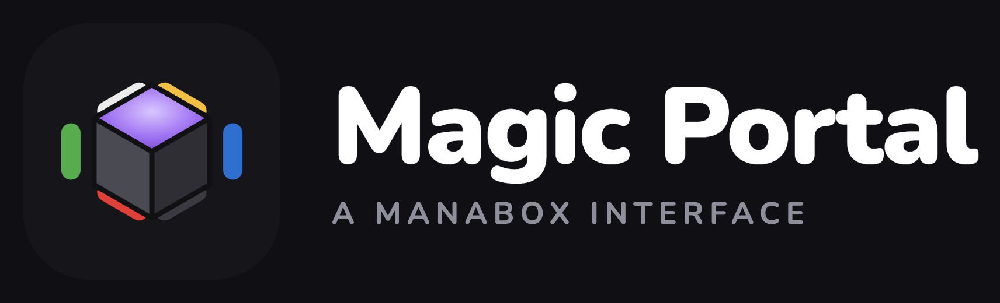

<p align="center">
  
</p>

<p align="center">
  <strong>Ein selbstgehostetes Webportal für deine Magic: The Gathering Sammlung – aus einem ManaBox-CSV-Export.</strong>
</p>

<p align="center">
  
  
  
  
  
</p>

<p align="center">
  🔗 <strong>Live-Demo:</strong> <a href="https://mtg.kirkanos.net">mtg.kirkanos.net</a>
</p>

---

Läuft als kleiner Docker-Stack (nginx-Frontend + Go-Backend + SQLite). Kartenbilder,
Typzeilen und **Preise** kommen aus [Scryfall](https://scryfall.com) und werden im
Hintergrund gepflegt – die Oberfläche lädt alles fertig angereichert und schnell aus der API.
Inspiriert von [mtg-collection-viewer](https://github.com/pnz1990/mtg-collection-viewer).

## ✨ Features

- **🗃️ Karten-Ansicht** – durchsuchbares, filterbares Raster (Set, Rarität, Farbe, Foil, Sortierung). Gleiche Karten in verschiedenen Sprachen werden zu **einer** Kachel zusammengefasst (Gesamtanzahl + Sprachflaggen); jede Kachel zeigt Editionssymbol, ausgeschriebenen Set-Namen und die nach Rarität eingefärbte Rarität. Die **Suche** erfasst auch Kartentext und Manakosten (z. B. `2rr`, `wu`, `fliegend`).
- **🔍 Kartendetails** – Manakosten als Symbole, Kartentext (Oracle), pro Sprache/Ausführung/Zustand eine Zeile (Preis / Anzahl / Zustand / hinzugefügt am) sowie eine Galerie **aller weiteren Editionen** der Karte mit Bild, Edition und Preis.
- **📚 Editionen** – Überblick pro Set: besessen / fehlt / mehrfach, inklusive Editionen, aus denen du noch **keine** Karte hast. Set-Typ-Filter (Standard: sammelbare Typen, bis „alle"), aufklappbare Erklärung, Sortierung u. a. nach fehlenden Karten. Klick öffnet ein Overlay mit **allen** Karten der Edition (fehlende ausgegraut), Set-Symbol und dem Wert der fehlenden Karten.
- **📊 Statistik** – Charts zu Rarität, Farbverteilung, Sets, Foil-Anteil, Kaufwert über Zeit, wertvollste Karten und Editionen nach Marktwert.
- **✅ Deck-Checker** – Deckliste einfügen und sehen, welche Karten du schon besitzt.
- **🌐 Zweisprachig** – Oberfläche in Deutsch und Englisch, umschaltbar im Menü; die Auswahl wird gespeichert (Standard: Deutsch).
- **⬆️ CSV-Upload** – neue ManaBox-Exporte direkt im Menü hochladen (passwortgeschützt); neue Karten werden angelegt, bestehende aktualisiert (Upsert).
- **🔄 Auto-Sync** – Kartendaten & Preise werden alle 5 Minuten im Hintergrund aktualisiert (Download nur, wenn Scryfall wirklich einen neuen Datensatz veröffentlicht hat).

## 🏗️ Architektur

```text
        ┌── web (nginx) ───────┐   statische Oberfläche + Reverse-Proxy /api → backend
Traefik │                      │
  ──────▶  mtg.example.net     │
        └──────────┬───────────┘
                   │ /api
        ┌──────────▼───────────┐   Go-Backend: REST-API + Background-Sync
        │  backend (Go)        │   (SQLite im Volume "mtg-db")
        └──────────────────────┘
```

- Metadaten, Bilder und **Preise** stammen aus **Scryfall Bulk Data** – einem täglich aktualisierten Komplettdump, den das Backend im Hintergrund lädt und in SQLite ablegt (statt tausender Einzel-API-Calls im Browser).
- Der Hintergrundjob läuft **alle 5 Minuten**: er prüft günstig, ob ein neuer Dump vorliegt, und lädt die ~140 MB nur dann. Der Set-Index wird wöchentlich aktualisiert.

## 🚀 Schnellstart

```bash
cp .env.sample .env      # SERVICE / HOST / PORT / UPLOAD_PASSWORD anpassen
docker compose up -d --build
```

Der Stack ist für den Betrieb hinter [Traefik](https://traefik.io) gedacht und wird unter
`https://$HOST` veröffentlicht. Er startet mit **leerem Datenbestand** – lade deine ManaBox-CSV
über das Menü hoch (siehe unten). Die Scryfall-Daten werden beim Start im Hintergrund geladen.

> **Lokaler Test:** Die `docker-compose.yml` erwartet das externe Traefik-Netzwerk. Ohne Traefik
> vorweg einmalig `docker network create traefik-network` anlegen (bzw. für eine schnelle Vorschau
> ein Port-Mapping auf den `web`-Dienst ergänzen).

## 📥 Sammlung befüllen & aktualisieren

Oben rechts im Menü: **„🔒 Upload freischalten"** → Passwort → **„⬆ CSV hochladen"**.
Neue Karten werden hinzugefügt, bestehende aktualisiert (Upsert). **„Leeren"** entfernt die
gesamte Sammlung wieder.

Erwartete Spalten (Standard-ManaBox-Export):
`Name, Set code, Set name, Collector number, Foil, Rarity, Quantity, Scryfall ID, Purchase price, Purchase price currency, Condition, Language, Added`.

Der **Datenstand** (letzte Aktualisierung von Kartendaten/Preisen) steht oben rechts im Menü;
**„🔄 Aktualisieren"** stößt einen sofortigen Scryfall-Sync an.

## ⚙️ Konfiguration (`.env`)

| Variable | Zweck |
|---|---|
| `SERVICE` | Dienstname (Container-Namen, Traefik-Router, systemd-Unit, `/services/$SERVICE`) |
| `HOST` | Öffentliche Domain (Traefik-Routing + TLS) |
| `PORT` | Interner Port des `web`-Containers (nginx, 80) |
| `UPLOAD_PASSWORD` | Passwort für Upload/Reset/Sync (leer = kein Schutz) |

Optional: `SYNC_INTERVAL_MINUTES` (Standard 5) steuert das Hintergrund-Intervall.
Die Datenbank liegt im benannten Volume `mtg-db`. Das Passwort wird via `X-Upload-Password`-Header
übertragen (kein Browser-Login-Dialog).

## 🔐 Deployment (Woodpecker CI + SOPS)

Push auf `main` löst die [Woodpecker](https://woodpecker-ci.org)-Pipeline aus
([`.woodpecker/pipeline.yaml`](.woodpecker/pipeline.yaml)):

1. **Decrypt** – `.env.enc` wird per [SOPS](https://github.com/getsops/sops) (age) zu `.env` entschlüsselt.
2. **Deploy** – Quellen werden nach `/services/$SERVICE` kopiert, die systemd-Unit installiert.
3. **Restart** – der Dienst startet neu und baut per `docker compose up --build` auf dem Host.

Secrets (Woodpecker): `sops_age_key`, `ssh_host_local`.
Die Zugangsdaten liegen **verschlüsselt** in [`.env.enc`](.env.enc); Klartext-`.env` ist gitignored.

```bash
# .env bearbeiten und neu verschlüsseln:
sops --encrypt --age <age-recipient> --input-type dotenv --output-type dotenv .env > .env.enc
```

## 🛡️ Hardening

Beide Container laufen mit `read_only`-Rootfs, `cap_drop: ALL` (web nur mit den nötigen
nginx-Caps), `no-new-privileges` sowie Speicher-/PID-Limits. Das Backend läuft als
Non-Root-User (uid 10001); sein Port ist nicht nach außen gemappt – erreichbar nur über den
nginx-Proxy.

## 🔌 API

| Methode | Pfad | Zweck |
|---|---|---|
| `GET` | `/api/collection` | Sammlung, angereichert mit Scryfall-Daten |
| `GET` | `/api/sets` | Set-Index |
| `GET` | `/api/sets/{code}/cards` | Alle Karten eines Sets |
| `GET` | `/api/prints?name=…` | Alle Drucke einer Karte (Editionen) |
| `GET` | `/api/status` | Sync-Status & Datenstand |
| `GET` | `/api/auth-check` | Passwortprüfung (204/403) |
| `POST` | `/api/upload` | CSV hochladen (Upsert) |
| `POST` | `/api/reset` | Sammlung leeren |
| `POST` | `/api/sync` | Scryfall-Sync jetzt anstoßen |

## 🗂️ Projektstruktur

```text
mtg-portal/
├── app/                     # nginx-Docroot (statische Oberfläche)
│   ├── index.html · editions.html · dashboard.html · deck-checker.html
│   ├── css/style.css
│   ├── js/i18n.js · shared.js · grid.js · editions.js · dashboard.js · deck-checker.js
│   └── images/              # Logo & Favicons
├── backend/                 # Go-Backend (API + Sync-Jobs)
│   ├── main.go · db.go · csvimport.go · scryfall.go
│   └── Dockerfile
├── nginx/default.conf       # statisch + Proxy /api → backend
├── .woodpecker/pipeline.yaml
├── template.service         # systemd-Unit (Vorlage, %SERVICE%)
├── Dockerfile               # web-Image
├── docker-compose.yml
├── .env.enc                 # SOPS-verschlüsselte Secrets (.env ist gitignored)
└── LICENSE
```

## 📄 Lizenz

[MIT](LICENSE) – frei nutzbar, anpassbar und weiterverteilbar.

Kartendaten und -bilder stammen von [Scryfall](https://scryfall.com); *Magic: The Gathering*
ist ein Markenzeichen von Wizards of the Coast. Dieses Projekt steht in keiner Verbindung zu
Wizards of the Coast oder ManaBox.
