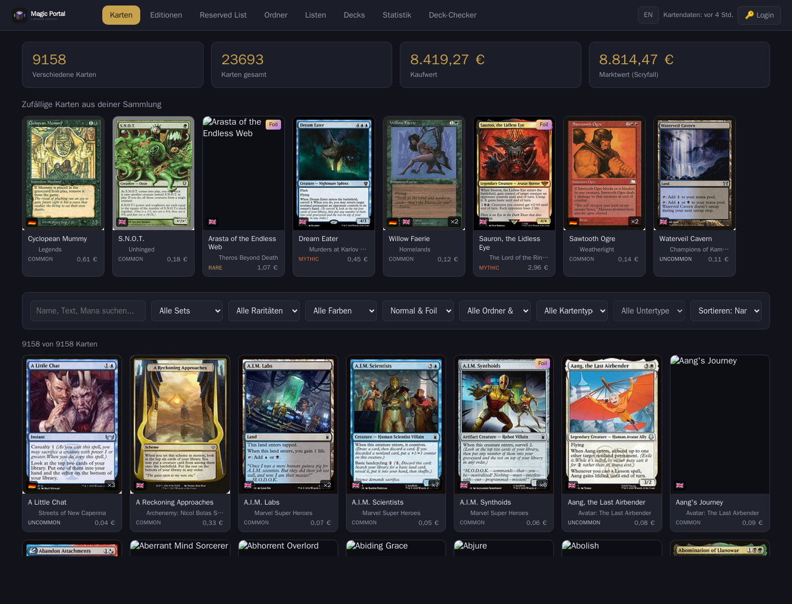
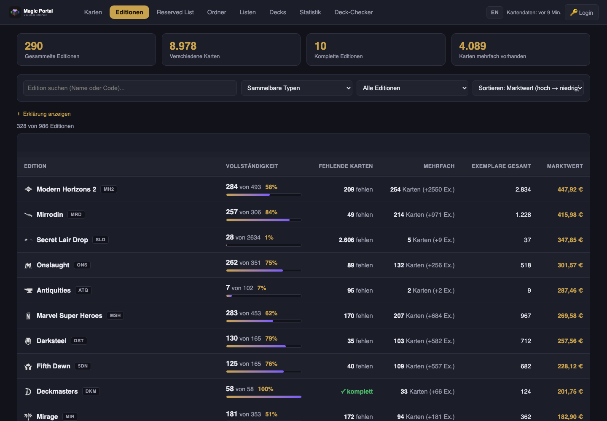
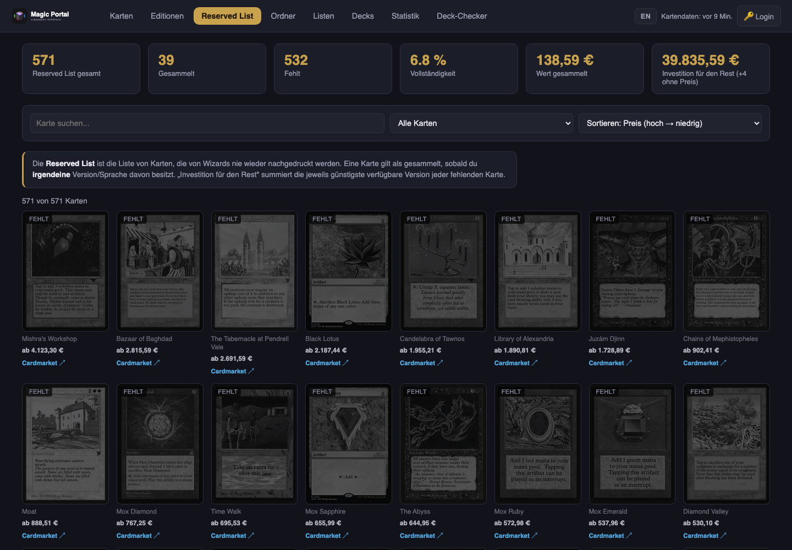
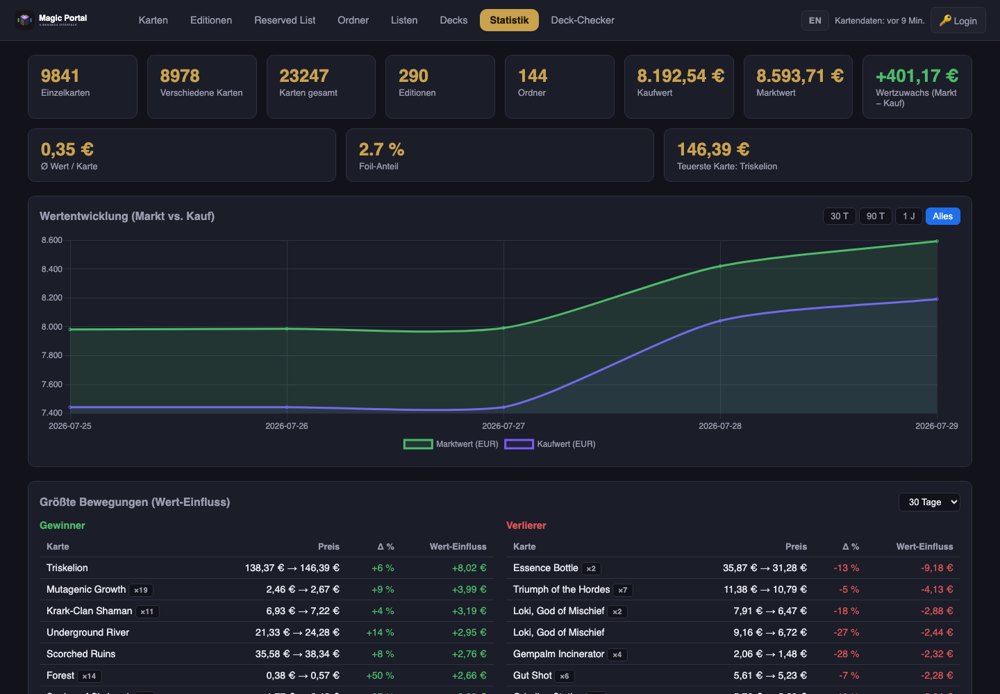

<p align="center">
  
</p>

<p align="center">
  <strong>Ein selbstgehostetes Webportal für deine Magic: The Gathering Sammlung – aus einem ManaBox-CSV-Export.</strong>
</p>

<p align="center">
  
  
  
  
  
</p>

<p align="center">
  🔗 <strong>Live-Demo:</strong> <a href="https://mtg.kirkanos.net">mtg.kirkanos.net</a>
</p>

---

Läuft als kleiner Docker-Stack (nginx-Frontend + Go-Backend + SQLite). Kartenbilder,
Typzeilen und **Preise** kommen aus [Scryfall](https://scryfall.com) und werden im
Hintergrund gepflegt – die Oberfläche lädt alles fertig angereichert und schnell aus der API.
Inspiriert von [mtg-collection-viewer](https://github.com/pnz1990/mtg-collection-viewer).

## 📸 Eindrücke

|  |  |
|---|---|
| <br>*Karten-Ansicht: Raster mit Filtern, Preisen, Sprachflaggen* | <br>*Editionen: gesammelt / fehlt / mehrfach je Set* |
| <br>*Reserved List: besessen vs. fehlend + Investition* | <br>*Statistik: Wertentwicklung & größte Bewegungen* |

<sub>Screenshots von der [Live-Demo](https://mtg.kirkanos.net). Aktuell halten mit `docs/screenshots.sh` (nutzt headless Chrome, kein Node nötig).</sub>

## ✨ Features

- **🗃️ Karten-Ansicht** – durchsuchbares, filterbares Raster (Set, Rarität, Farbe, Foil, **Ordner/Liste**, **Kartentyp & Untertyp** – z. B. Creature → Dragon, Sortierung inkl. Erscheinungsdatum). Gleiche Karten in verschiedenen Sprachen werden zu **einer** Kachel zusammengefasst (Gesamtanzahl + Sprachflaggen); jede Kachel zeigt Editionssymbol, ausgeschriebenen Set-Namen und die nach Rarität eingefärbte Rarität. Die **Stichwort-Suche** (UND) erfasst auch Kartentext und Manakosten (z. B. `create token soldier`, `2rr`, `wu`).
- **🔍 Kartendetails** – Manakosten als Symbole, Kartentext (Oracle), pro Sprache/Ausführung/Zustand eine Zeile (Ordner / Preis / Anzahl / Zustand / hinzugefügt am) sowie eine Galerie **aller weiteren Editionen** der Karte mit Bild, Edition und Preis. Bei **doppelseitigen Karten** (Transform/MDFC) wird zusätzlich die **Rückseite** angezeigt – sowohl in der Karten- als auch in der Editions-Detailansicht.
- **📚 Editionen** – Überblick pro Set: besessen / fehlt / mehrfach, inklusive Editionen, aus denen du noch **keine** Karte hast. Set-Typ-Filter (Standard: sammelbare Typen, bis „alle"), aufklappbare Erklärung, Sortierung u. a. nach fehlenden Karten und Erscheinungsdatum. Klick öffnet ein Overlay mit **allen** Karten der Edition (fehlende ausgegraut), Set-Symbol, dem Wert der fehlenden Karten und – bei besessenen Karten – dem Ordner. In der Kartendetailansicht führt ein direkter **Cardmarket-Link** zum jeweiligen Produkt.
- **🏛️ Reserved List** – Überblick über Wizards' [Reserved List](https://magic.wizards.com/en/formats/reserved-list): welche Karten du besitzt (jede Version/Sprache zählt) und welche fehlen, als Karten-Raster (fehlende ausgegraut). Kennzahlen: Anzahl gesammelt/fehlend, Vollständigkeit, **Wert der gesammelten** Karten und die nötige **Investition, um den Rest zu kaufen** (jeweils günstigste verfügbare Version). Filter (alle/gesammelt/fehlend), Suche und Sortierung nach Preis/Name.
- **📁 Ordner & Listen** – eigene Übersichtsseiten für ManaBox-Ordner (Binder) und -Listen mit Kartenanzahl und Wert; Klick springt in die gefilterte Karten-Ansicht.
- **🧩 Decks** – Menüpunkt für künftigen Deck-Import/-Export (derzeit Platzhalter, noch ohne Funktion).
- **📊 Statistik** – umfangreiches Dashboard: Kennzahlen (Einträge, Karten, Editionen, Ordner, Kauf-/Marktwert, Wertzuwachs Markt − Kauf, Ø-Wert, Foil-Anteil, teuerste Karte) sowie Charts zu Rarität, Farben, Kartentypen, Sprachen, Zustand, Manawert, Foil, Kaufwert & Zugänge über Zeit, wertvollste Karten (Kauf/Markt), **wertgewichtet** nach Farbe und Rarität, Preisklassen-Verteilung und **Detailtabellen** (Rarität, Editionen) mit Einträgen, Exemplaren, Marktwert, Ø-Wert und Wertanteil.
- **📈 Wertentwicklung** – das Backend schreibt täglich einen (foil-bewussten) Wert-Snapshot der Sammlung. Das Dashboard zeigt daraus die **Markt- vs. Kaufwert-Kurve** über Zeit (Zeitraum 30 T / 90 T / 1 J / alles) und die **größten Bewegungen** (Gewinner/Verlierer je Zeitraum, gewichtet nach gehaltener Menge). Die Historie entsteht ab Deployment vorwärts (keine rückwirkenden Preisdaten).
- **✅ Deck-Checker** – Deckliste einfügen und sehen, welche Karten du schon besitzt.
- **🌐 Zweisprachig** – Oberfläche in Deutsch und Englisch, umschaltbar im Menü; die Auswahl wird gespeichert (Standard: Deutsch).
- **⬆️ CSV-Upload** – neue ManaBox-Exporte direkt im Menü hochladen (passwortgeschützt); der Import **ersetzt** die Sammlung vollständig, sodass sie exakt der CSV entspricht (nicht mehr enthaltene Karten verschwinden).
- **🔄 Auto-Sync** – Kartendaten & Preise werden alle 5 Minuten im Hintergrund aktualisiert (Download nur, wenn Scryfall wirklich einen neuen Datensatz veröffentlicht hat).
- **🧾 Aktivitätsprotokoll** – ein **nur im eingeloggten Zustand** sichtbarer Menüpunkt „Aktivität" zeigt die letzten Aktionen des Tools (Importe, Sync, Backups, Wiederherstellungen) samt Fehlermeldungen. Das Protokoll ist **persistent** (übersteht Neustarts) und lässt sich jederzeit leeren.

## 🏗️ Architektur

```text
        ┌── web (nginx) ───────┐   statische Oberfläche + Reverse-Proxy /api → backend
Traefik │                      │
  ──────▶  mtg.example.net     │
        └──────────┬───────────┘
                   │ /api
        ┌──────────▼───────────┐   Go-Backend: REST-API + Background-Sync
        │  backend (Go)        │   (SQLite im Volume "mtg-db")
        └──────────────────────┘
```

- Metadaten, Bilder und **Preise** stammen aus **Scryfall Bulk Data** – einem täglich aktualisierten Komplettdump, den das Backend im Hintergrund lädt und in SQLite ablegt (statt tausender Einzel-API-Calls im Browser).
- Der Hintergrundjob läuft **alle 5 Minuten**: er prüft günstig, ob ein neuer Dump vorliegt, und lädt die ~140 MB nur dann. Der Set-Index wird wöchentlich aktualisiert.

## 🚀 Schnellstart

```bash
cp .env.sample .env      # SERVICE / HOST / PORT / UPLOAD_PASSWORD anpassen
docker compose up -d --build
```

Der Stack ist für den Betrieb hinter [Traefik](https://traefik.io) gedacht und wird unter
`https://$HOST` veröffentlicht. Er startet mit **leerem Datenbestand** – lade deine ManaBox-CSV
über das Menü hoch (siehe unten). Die Scryfall-Daten werden beim Start im Hintergrund geladen.

> **Lokaler Test:** Die `docker-compose.yml` erwartet das externe Traefik-Netzwerk. Ohne Traefik
> vorweg einmalig `docker network create traefik-network` anlegen (bzw. für eine schnelle Vorschau
> ein Port-Mapping auf den `web`-Dienst ergänzen).

## 📥 Sammlung befüllen & aktualisieren

Oben rechts im Menü: **„🔑 Login"** → Passwort → dann erscheinen **„⬆ CSV hochladen"**, **„Leeren"**,
**„💾 Backup"** und **„⟲ Wiederherstellen"** (alle Aktionen sind erst nach dem Login sichtbar).
Der Import **ersetzt** die Sammlung vollständig: Der Datenbestand entspricht danach exakt der
hochgeladenen CSV – Karten, die nicht mehr enthalten sind, werden entfernt (atomar; bei einem
Fehler bleibt die bisherige Sammlung erhalten). **„Leeren"** entfernt die gesamte Sammlung.

Erwartete Spalten (Standard-ManaBox-Export):
`Name, Set code, Set name, Collector number, Foil, Rarity, Quantity, Scryfall ID, Purchase price, Purchase price currency, Condition, Language, Added`.

Der **Datenstand** (letzte Aktualisierung von Kartendaten/Preisen) steht oben rechts im Menü;
**„🔄 Aktualisieren"** stößt einen sofortigen Scryfall-Sync an.

## ⚙️ Konfiguration (`.env`)

| Variable | Zweck |
|---|---|
| `SERVICE` | Dienstname (Container-Namen, Traefik-Router, systemd-Unit, `/services/$SERVICE`) |
| `HOST` | Öffentliche Domain (Traefik-Routing + TLS) |
| `PORT` | Interner Port des `web`-Containers (nginx, 80) |
| `UPLOAD_PASSWORD` | Passwort für Upload/Reset/Sync (leer = kein Schutz) |

Optional: `SYNC_INTERVAL_MINUTES` (Standard 5) steuert das Hintergrund-Intervall.
Die Datenbank liegt im benannten Volume `mtg-db`. Das Passwort wird via `X-Upload-Password`-Header
übertragen (kein Browser-Login-Dialog).

### 📥 Automatischer Remote-Import (optional)

Das Backend kann regelmäßig eine Nextcloud- und/oder Google-Drive-Datei nach einem neuen
ManaBox-Export durchsuchen und ihn bei Änderung automatisch importieren (Full-Replace, wie beim
manuellen Upload). Die Änderungserkennung nutzt ETag/`Last-Modified` bzw. die Datei-Prüfsumme –
unveränderte Dateien werden nicht erneut importiert. Alle Felder sind optional; leer = deaktiviert.
Der **„🔄 Aktualisieren"-Button** stößt diese Prüfung zusätzlich manuell an (nur wenn eine Quelle
konfiguriert ist); andernfalls aktualisiert er nur die Scryfall-Daten.

| Variable | Zweck |
|---|---|
| `REMOTE_IMPORT_INTERVAL_MINUTES` | Prüf-Intervall (Standard 15) |
| `REMOTE_IMPORT_DELETE` | Quelldatei nach erfolgreichem Import löschen (Standard `true`; `false` = behalten) |
| `WEBDAV_URL` | Direkte WebDAV-URL zur CSV (Nextcloud: `…/remote.php/dav/files/<user>/<pfad>/export.csv`) |
| `WEBDAV_USER` | Nextcloud-Benutzer |
| `WEBDAV_PASSWORD` | Nextcloud-**App-Passwort** (nicht das Login-Passwort) |
| `GDRIVE_FILE_ID` | Datei-ID der CSV in Google Drive |
| `GDRIVE_SA_JSON` | Service-Account-JSON (inline, base64-kodiert oder Pfad zu gemounteter Datei) |

**Google Drive:** einen Service-Account in der Google Cloud Console anlegen, die Drive-API aktivieren
und die CSV-Datei (bzw. deren Ordner) für die Service-Account-E-Mail freigeben. Für den reinen Import
genügt lesender Zugriff (`drive.readonly`); ist `REMOTE_IMPORT_DELETE` aktiv, wird der Schreib-Scope
`drive` angefordert und die Datei muss für den Service-Account **löschbar** sein (Bearbeiter-Recht;
kann sie nicht endgültig gelöscht werden, wird sie in den Papierkorb verschoben). Der Zugriff läuft
komplett über die Go-Standardbibliothek (JWT-Signierung), ohne zusätzliche Abhängigkeit.

Nach einem erfolgreichen Import wird die Quelldatei standardmäßig **gelöscht** (bei Nextcloud per
WebDAV-`DELETE`), sodass ein neuer ManaBox-Export einfach wieder abgelegt werden kann. Mit
`REMOTE_IMPORT_DELETE=false` bleibt die Datei liegen.

Der zuletzt erfolgte Remote-Import (Zeitpunkt, Quelle, evtl. Fehler) wird unter `/api/status`
ausgewiesen.

### 💾 Automatisches Backup (optional)

Die **eigenen, nicht wiederherstellbaren Daten** – Sammlung (`collection`) und die Wert-Historie
(`value_snapshots`, `price_history`) – werden regelmäßig in eine kompakte, gzip-komprimierte
SQLite-Datei gesichert und als **datierte Kopie** zu jeder konfigurierten Quelle hochgeladen
(Nextcloud per WebDAV-`PUT`, Google Drive per API). Der Scryfall-Katalog wird **nicht** gesichert
(er wird ohnehin neu geladen), daher bleibt ein Backup klein (typisch < 1 MB).

Bei **leerer Datenbank** (frisches Volume) stellt das Backend beim Start automatisch das neueste
Remote-Backup wieder her. Manuell geht das ebenfalls – siehe Endpoints unten.

| Variable | Zweck |
|---|---|
| `BACKUP_INTERVAL_HOURS` | Backup-Intervall (Standard 24) |
| `BACKUP_KEEP` | Anzahl behaltener Kopien; ältere werden gelöscht (Standard 30, `0` = alle behalten) |
| `WEBDAV_BACKUP_DIR` | Ziel-**Ordner** als WebDAV-URL (z. B. `…/remote.php/dav/files/<user>/mtg-backups/`); nutzt `WEBDAV_USER`/`WEBDAV_PASSWORD` |
| `GDRIVE_BACKUP_FOLDER_ID` | Ziel-**Ordner-ID** in Google Drive; nutzt `GDRIVE_SA_JSON` |

**Google Drive (Backup):** Der Ziel-Ordner muss für die Service-Account-E-Mail mit **Bearbeiter**-Recht
freigegeben sein. Für das Backup wird der Schreib-Scope `drive` angefordert (Import allein nutzt weiter
nur `drive.readonly`).

Endpoints (passwortgeschützt): `POST /api/backup` (jetzt sichern),
`POST /api/backup/restore-latest` (neuestes Remote-Backup einspielen),
`POST /api/backup/restore-upload` (hochgeladene `.db.gz` einspielen). Backup-Status (Zeitpunkt,
Datei, letzter Restore, evtl. Fehler) steht unter `/api/status`.

## 🔐 Deployment (Woodpecker CI + SOPS)

Push auf `main` löst die [Woodpecker](https://woodpecker-ci.org)-Pipeline aus
([`.woodpecker/pipeline.yaml`](.woodpecker/pipeline.yaml)):

1. **Decrypt** – `.env.enc` wird per [SOPS](https://github.com/getsops/sops) (age) zu `.env` entschlüsselt.
2. **Deploy** – Quellen werden nach `/services/$SERVICE` kopiert, die systemd-Unit installiert.
3. **Restart** – der Dienst startet neu und baut per `docker compose up --build` auf dem Host.

Secrets (Woodpecker): `sops_age_key`, `ssh_host_local`.
Die Zugangsdaten liegen **verschlüsselt** in [`.env.enc`](.env.enc); Klartext-`.env` ist gitignored.

```bash
# .env bearbeiten und neu verschlüsseln:
sops --encrypt --age <age-recipient> --input-type dotenv --output-type dotenv .env > .env.enc
```

## 🛡️ Hardening

Beide Container laufen mit `read_only`-Rootfs, `cap_drop: ALL` (web nur mit den nötigen
nginx-Caps), `no-new-privileges` sowie Speicher-/PID-Limits. Das Backend läuft als
Non-Root-User (uid 10001); sein Port ist nicht nach außen gemappt – erreichbar nur über den
nginx-Proxy.

## 🔌 API

| Methode | Pfad | Zweck |
|---|---|---|
| `GET` | `/api/collection` | Sammlung, angereichert mit Scryfall-Daten |
| `GET` | `/api/sets` | Set-Index |
| `GET` | `/api/sets/{code}/cards` | Alle Karten eines Sets |
| `GET` | `/api/prints?name=…` | Alle Drucke einer Karte (Editionen) |
| `GET` | `/api/binders` | Ordner/Listen mit Kartenanzahl & Wert |
| `GET` | `/api/status` | Sync-Status & Datenstand |
| `GET` | `/api/summary` | Kompakte Kennzahlen (Kartenzahl + Sammlungswert), öffentlich mit CORS – für Einbettung |
| `GET` | `/api/auth-check` | Passwortprüfung (204/403) |
| `POST` | `/api/upload` | CSV hochladen (Upsert) |
| `POST` | `/api/reset` | Sammlung leeren |
| `POST` | `/api/sync` | Scryfall-Sync jetzt anstoßen |

## 🗂️ Projektstruktur

```text
mtg-portal/
├── app/                     # nginx-Docroot (statische Oberfläche)
│   ├── index.html · editions.html · binders.html · lists.html · decks.html · dashboard.html · deck-checker.html
│   ├── css/style.css
│   ├── js/i18n.js · shared.js · grid.js · editions.js · binders.js · dashboard.js · deck-checker.js
│   └── images/              # Logo & Favicons
├── backend/                 # Go-Backend (API + Sync-Jobs)
│   ├── main.go · db.go · csvimport.go · scryfall.go
│   └── Dockerfile
├── nginx/default.conf       # statisch + Proxy /api → backend
├── .woodpecker/pipeline.yaml
├── template.service         # systemd-Unit (Vorlage, %SERVICE%)
├── Dockerfile               # web-Image
├── docker-compose.yml
├── .env.enc                 # SOPS-verschlüsselte Secrets (.env ist gitignored)
└── LICENSE
```

## 📄 Lizenz

[Apache License 2.0](LICENSE) – frei nutzbar, anpassbar und weiterverteilbar, inklusive
ausdrücklicher Patentlizenz. Urheberrechtshinweise siehe [NOTICE](NOTICE).

Kartendaten und -bilder stammen von [Scryfall](https://scryfall.com); *Magic: The Gathering*
ist ein Markenzeichen von Wizards of the Coast. Dieses Projekt steht in keiner Verbindung zu
Wizards of the Coast oder ManaBox.
